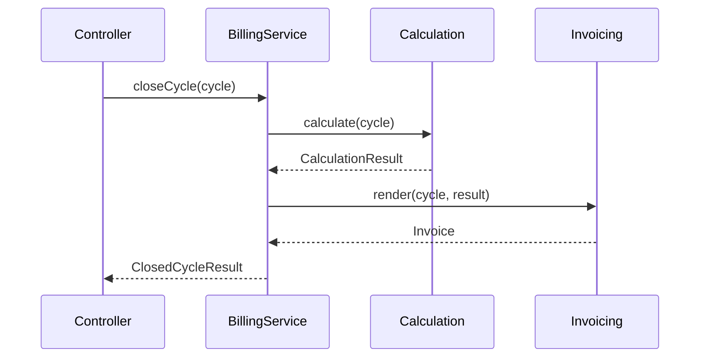

# Example: Domain with Sub-Modules — Billing

A billing domain that has grown enough internal complexity to warrant decomposition. Calculation and invoicing are independent enough to be sub-modules; the parent hosts the orchestration that ties them together.

## Shape

```
app/Modules/Billing/
├── README.md
├── BillingServiceProvider.php               ← provider earned (manual event wiring)
├── Public/
│   └── Services/
│       └── BillingService.php               ← orchestrates Calculation + Invoicing
├── Models/
│   └── BillingCycle.php                     ← parent-owned, used by both sub-modules
├── Enums/
│   └── BillingStatus.php
├── Events/
│   ├── CycleStarted.php
│   └── CycleClosed.php
└── Modules/
    ├── Calculation/
    │   ├── README.md
    │   ├── Public/
    │   │   └── Services/
    │   │       └── CalculationService.php
    │   ├── Services/
    │   │   ├── LineItemAggregator.php
    │   │   └── DiscountResolver.php
    │   ├── Data/
    │   │   ├── CalculationRequestData.php
    │   │   └── CalculationResultData.php
    │   └── Exceptions/
    │       └── CalculationFailed.php
    └── Invoicing/
        ├── README.md
        ├── Public/
        │   └── Services/
        │       └── InvoiceService.php
        ├── Services/
        │   └── PdfRenderer.php
        ├── Models/
        │   └── Invoice.php
        ├── Data/
        │   └── InvoiceData.php
        └── Http/Controllers/
            └── InvoicesController.php       ← Invoicing owns its HTTP entry
```

## Parent README content

```markdown
# Billing

Coordinates billing cycles by orchestrating calculation and invoicing for each customer. Owns the cycle lifecycle and enforces the invariant that a customer is never billed twice for the same period.

Public surface:
- BillingService — close a billing cycle for a customer

Sub-modules:
- Calculation — computes line items, discounts, totals
- Invoicing — renders and persists invoices

Guarantees:
- A BillingCycle can only be closed once
- Closing runs Calculation then Invoicing inside a single transaction
```

## Why this shape

- **Sub-modules earn their place.** Calculation and Invoicing each have their own services, data, and (for Invoicing) models. Inlining either back into `Billing/Public/Services/` would noticeably bloat the parent.
- **Parent has its own `Public/Services/`** because `BillingService.closeCycle()` orchestrates Calculation + Invoicing inside a transaction with the "never bill twice" invariant. That orchestration *requires* a parent-owned home.
- **Parent has `Models/`** (`BillingCycle`) because the value is used by both sub-modules. Placing it in either sub-module would create a cross-sub-module model dependency. Promoting it to the parent is the right call.
- **Service provider exists** because Billing wires up an event listener manually that auto-discovery can't infer.
- **Invoicing has its own HTTP controller** — invoice display and download are user-facing concerns owned by Invoicing, not the parent.

## Cross-sub-module flow



Calculation and Invoicing don't talk directly. The parent orchestrates.

## Where alternative shapes would be wrong

- **Single flat module** would put `LineItemAggregator`, `DiscountResolver`, `PdfRenderer`, `CalculationService`, `InvoiceService` all in one `Services/` directory. Two distinct concerns share a single namespace, and the public/internal split becomes harder to read.
- **No parent `Public/Services/`** would force callers to know they have to call Calculation, then Invoicing, in the right order, in a transaction, with the "never twice" check. That's exactly the orchestration the parent should hide.
- **Calculation calling Invoicing directly** would create cross-sub-module coupling. Sub-modules are public peers; their orchestration is the parent's job.
