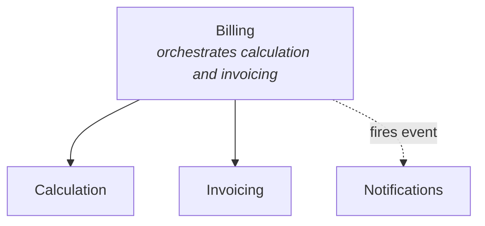
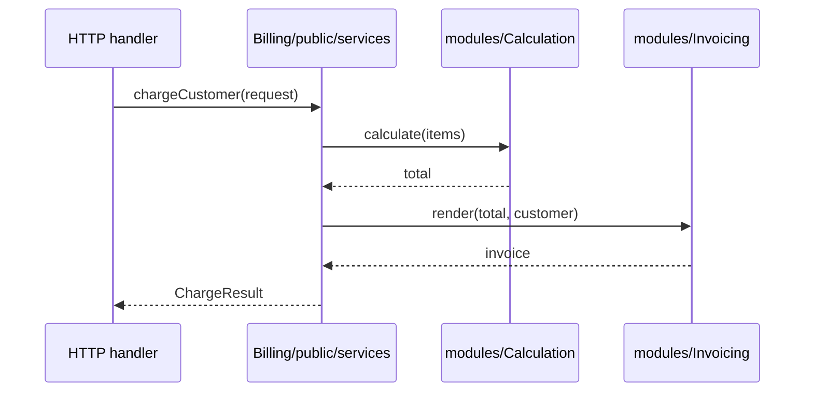
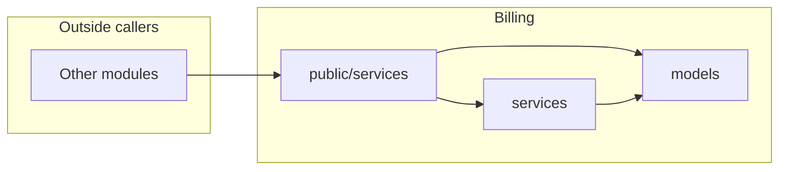

# Visualization

How to render a module's structure for human consumption — ASCII trees for terminals and code blocks, Mermaid diagrams for chat and rich markdown, tables for quick reference.

This file is for moments when you need to *show* a structure to a teammate (during planning, architecture review, or explanation), not just place files. Directory names are the neutral defaults — draw with your [binding](bindings/)'s real names.

## ASCII trees — the canonical format

ASCII trees are the workhorse. They render correctly in:
- Terminals
- Code blocks in chat
- Git diffs and PR descriptions
- Plain text email
- Any markdown renderer

### Template — flat module

```
modules/Billing/
├── README.md
├── public/
│   └── services/
│       └── BillingService
├── models/
│   └── Invoice
├── data/
│   └── InvoiceData
└── entrypoints/http/
    └── InvoicesController
```

### Template — module with sub-modules

```
modules/Billing/
├── README.md
├── public/
│   └── services/
│       └── BillingService              ← orchestrates sub-modules
└── modules/
    ├── Calculation/
    │   ├── README.md
    │   └── public/services/
    │       └── CalculationService
    └── Invoicing/
        ├── README.md
        └── public/services/
            └── InvoiceRenderingService
```

### Template — variant module

```
modules/PaymentGateways/
├── README.md
├── framework/
│   └── public/
│       ├── contracts/
│       │   └── PaymentGatewayContract
│       └── services/
│           └── PaymentGatewayDispatcher
├── Stripe/
│   ├── README.md
│   └── public/services/
│       └── StripeGateway
└── Paypal/
    ├── README.md
    └── public/services/
        └── PaypalGateway
```

### Annotation conventions

When using ASCII trees in conversation, annotate sparingly. Two patterns work well:

- **Inline arrows for purpose:** `└── BillingService              ← orchestrates sub-modules`
- **Visibility markers:** `models/                              ← internal` or `public/data/                         ← published contract`

Don't annotate every line — only the parts that need explaining. The tree itself does most of the talking.

## Mermaid — for relationships

Mermaid renders in many markdown contexts (GitHub, GitLab, chat clients with markdown support). It's the right tool when you need to show *relationships* between modules, not file structure.

### Template — module dependency graph



Conventions:
- Solid arrows for direct calls (importing `public/services/`)
- Dashed arrows for event-based connections
- Italic descriptions in node labels for what each module hides

### Template — flow through public surface



Useful for showing how an entry point delegates to `public/services/` and how that orchestrates sub-modules.

### Template — public/internal boundary



Useful for explaining the public surface rule — outside callers reach `public/services/` only, and `public/services/` is the gateway to internals.

## Tables — for quick directory listings

When the goal is to enumerate a module's contents without showing nesting, a table is denser than ASCII art:

| Path | Purpose |
|---|---|
| `public/services/BillingService` | Orchestrates billing flow |
| `modules/Calculation/` | Calculation logic |
| `modules/Invoicing/` | Invoice rendering |
| `models/Invoice` | Persistence entity |

## When to use which

| Format | Use for |
|---|---|
| ASCII tree | Showing file structure, scaffolding a new module, reviewing module shape |
| Mermaid graph | Showing dependencies between modules |
| Mermaid sequence | Showing flow through `public/services/` and into sub-modules |
| Mermaid public/internal | Explaining the boundary rule |
| Table | Listing a module's contents without nesting |

## When explaining to a human

When sharing a structure in a conversation:

1. **Lead with the format that fits the medium.** ASCII for terminals; Mermaid for chat with rich rendering; table for a quick enumeration.
2. **Annotate the unusual.** Don't explain that `models/` is for models. Do explain why a sub-module has no `public/services/` of its own, or why a class lives in the parent rather than a sub-module.
3. **Keep depth proportional to the question.** A "where would I put X?" answer needs a tree showing the relevant module. A "how do these modules talk?" answer needs Mermaid showing dependencies.
4. **Combine formats when needed.** A planning conversation often uses ASCII for the file structure and a small Mermaid graph for the runtime relationships — they answer different questions.

## See also

- [`default-shape.md`](default-shape.md) — module templates
- [`examples/`](examples/README.md) — full worked examples in ASCII
